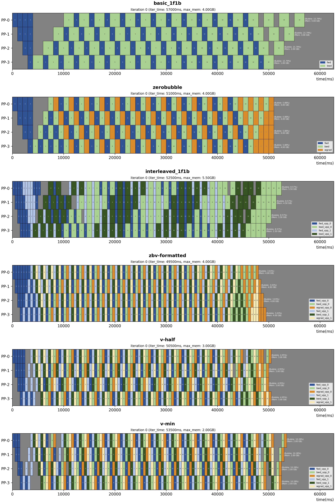

<p align="center">
  
</p>

# Primus-Pipe: A More Flexible and Scalable Pipeline Parallelism Implementation

A standalone version of the Primus-Pipeline module from [Primus](https://github.com/AMD-AGI/Primus).

- 📚 Blog: [Primus-Pipeline: A More Flexible and Scalable Pipeline Parallelism Implementation](https://rocm.blogs.amd.com/software-tools-optimization/primus-pipeline/README.html)

## Getting Started

### Installation

```shell
pip install .
```

### Simulator (no GPU required)

The simulator visualizes the theoretical scheduling timeline and bubble rate for each algorithm.

1. Edit `simulation/config/simulation.yaml` to configure the pipeline parameters.
2. Run the simulator to generate results (saved as JSON to `output_dir`, default `./pp_simulation_result`).
3. Use the visualizer to inspect the results.

```bash
pip install .[simulation]
python3 simulation/simulator.py --config=simulation/config/simulation.yaml
python3 simulation/vis.py --config=simulation/config/simulation.yaml
```



### PyTorch Demo (MNIST training, GPU required)

A set of end-to-end pipeline-parallel training demos on MNIST are provided in `example/pytorch/`.

```shell
pip install .[example]
```

| Schedule | Topology | Command |
|----------|----------|---------|
| Basic 1F1B | Standard (vpp=1) | `torchrun --nproc_per_node=4 example/pytorch/1f1b_demo.py` |
| Interleaved 1F1B | Standard (vpp=2) | `torchrun --nproc_per_node=4 example/pytorch/1f1b_interleaved_demo.py` |
| Zero Bubble | Standard (vpp=1, B/W split) | `torchrun --nproc_per_node=4 example/pytorch/zerobubble_demo.py` |
| ZBV Formatted | V-fold (vpp=2, B/W split) | `torchrun --nproc_per_node=4 example/pytorch/zbv_formatted_demo.py` |
| ZBV Greedy | V-fold (vpp=2, B/W split) | `torchrun --nproc_per_node=4 example/pytorch/zbv_greedy_demo.py` |

Each demo trains a simple MLP on MNIST split across 4 pipeline stages, printing the training loss at each step to demonstrate convergence.


## Acknowledgments

We would like to express our sincere gratitude to the [SeaAI lab](https://sail.sea.com/) team and individuals for their invaluable contributions and collaboration, their expertise and support have been instrumental in advancing the progress of this project.